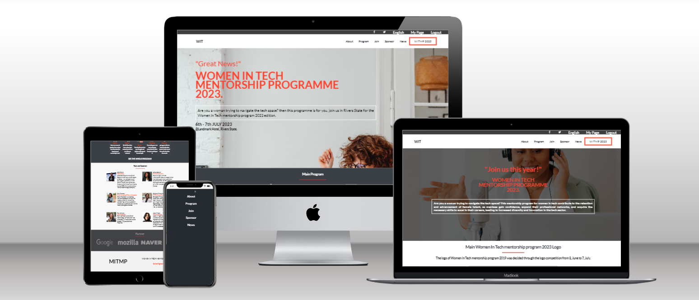

# 📗 Table of Contents

- [� Table of Contents](#-table-of-contents)
- [📖 WOMEN IN TECH MENTORSHIP PROGRAM ](#-women-intech-)
  - [🛠 Built With ](#-built-with-)
    - [Tech Stack ](#tech-stack-)
    - [Live Server](#live-server)
    - [Key Features ](#key-features-)
  - [💻 Getting Started ](#-getting-started-)
    - [Prerequisites](#prerequisites)
    - [Setup](#setup)
    - [Install](#install)
    - [Usage](#usage)
    - [Run tests](#run-tests)
    - [Deployment](#deployment)
  - [👥 Authors ](#-authors-)
  - [🔭 Future Features ](#-future-features-)
  - [🤝 Contributing ](#-contributing-)
  - [⭐ Show your support ](#-show-your-support-)
  - [🙏 Acknowledgments ](#-acknowledgments-)
  - [📝 License ](#-license-)

<!-- PROJECT DESCRIPTION -->

# 📖 WOMEN IN TECH MENTORSHIP PROGRAM. 

*Women in Tech Mentorship Program* is a website that gives more information about the Women in Tech Annual Mentorship program. It is my first microverse capstone project.

## 🛠 Built With 

### Tech Stack 

  
Client

  <ul>
    <li><a href="https://www.w3schools.com/html/">HTML</a></li>
    <li><a href="https://www.w3schools.com/css/">CSS</a></li>
  </ul>

 

### Live Demo 

[WOMEN IN TECH WEBSITE](https://www.loom.com/share/85d6ee4122a74986895ca5dd81e36352)

### Key Features 

- *Fully responsive for all screen sizes*
- *Social Media publicity*
- Use the Figma design for the project😊👌
- Use the semantics elements💯

(<a href="#readme-top">back to top</a>)

<!-- GETTING STARTED -->

## 💻 Getting Started 

To get a local copy up and running, follow these steps.

- [ ] Clone the repo from here:
  - https://github.com/JoyTaribagshaw/module-1-capstone-project 

### Prerequisites

In order to run this project you need:

- You need a PC.
- VS Code installed
- A browser

### Setup

- Clone this repository from this link: 
[Github](https://github.com/JoyTaribagshaw/module-1-capstone-project)
- Navigate to the clone reppository by running cd `module-1-capstone-project`

### Install

Install this project with:

  cd module-1-capstone-project-version
  npm install

### Usage

To run the project, execute the following command:

    open the index file in the browser

  ### Run tests

To run tests, click on inspect to open the browser dev tools where you can inspect the entire HTML and CSS code and the console for JavaScript code. 

### Deployment

You can deploy this project using:
Github pages.

### LIVE DEMO

- [LIVE DEMO](https://joytaribagshaw.github.io/module-1-capstone-project/)

(<a href="#readme-top">back to top</a>)

<!-- AUTHORS -->

## 👥 Authors 

👤 *Joy Tari*

- GitHub: [Joy](https://github.com/JoyTaribagshaw)
- Twitter: [Joy](https://twitter.com/JoyTariBagshaw)
- LinkedIn: [Joy](https://www.linkedin.com/in/joy-tari-bagshaw-b8b891236?lipi=urn%3Ali%3Apage%3Ad_flagship3_profile_view_base_contact_details%3BlJIF9fsfQCO4UIewGNO%2B%2FQ%3D%3D)

<!-- FUTURE FEATURES -->

## 🔭 Future Features 

**Add a registration page**

(<a href="#readme-top">back to top</a>)

<!-- CONTRIBUTING -->

## 🤝 Contributing 

Contributions, issues, and feature requests are welcome!

Feel free to check the [issues page](https://github.com/JoyTaribagshaw/module-1-capstone-project/issues/).

(<a href="#readme-top">back to top</a>)

<!-- SUPPORT -->

## ⭐ Show your support 

If you like this project give it a ⭐

(<a href="#readme-top">back to top</a>)

<!-- ACKNOWLEDGEMENTS -->

## 🙏 Acknowledgments 

I would like to give a warm thank you to [Cindy Shin](https://www.behance.net/adagio07) for the design template.

(<a href="#readme-top">back to top</a>)

<!-- LICENSE -->

## 📝 License 

This project is [MIT](https://github.com/JoyTaribagshaw/module-1-capstone-project/blob/main/LICENSE) licensed..

(<a href="#readme-top">back to top</a>)
 

